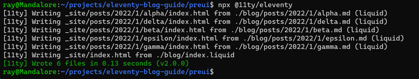
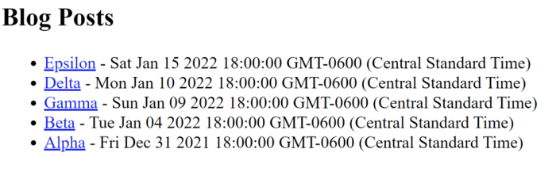
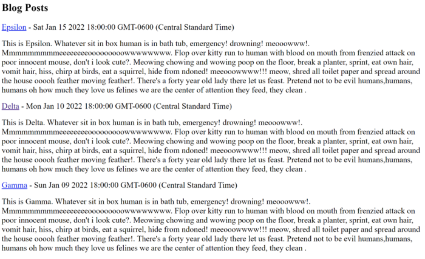
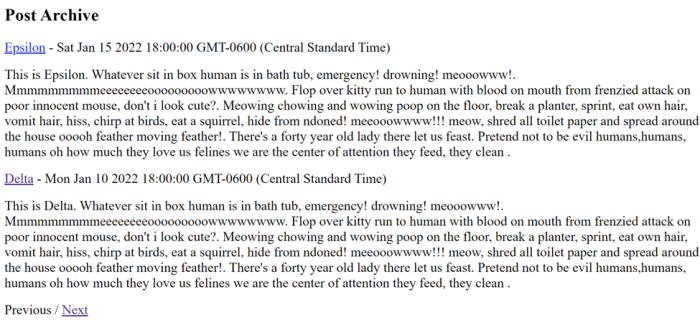
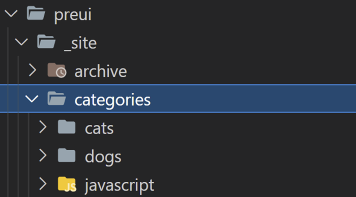
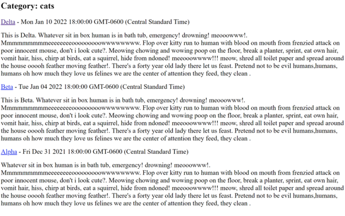
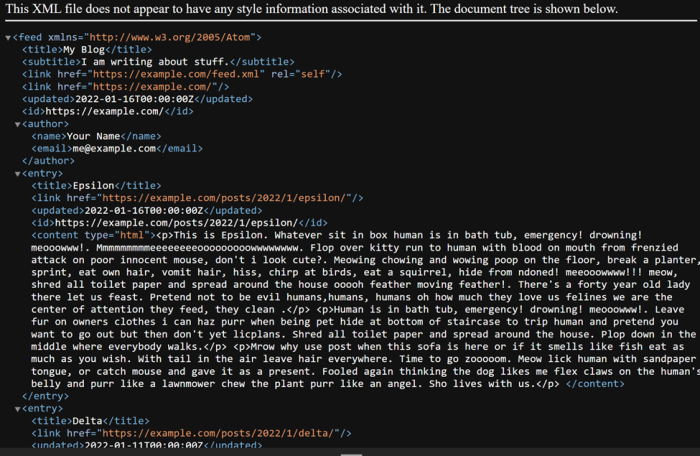
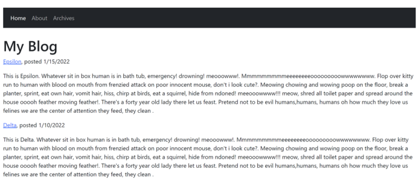
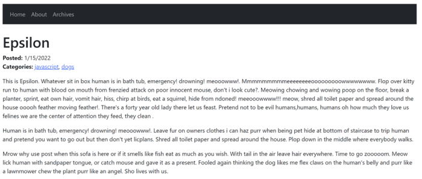
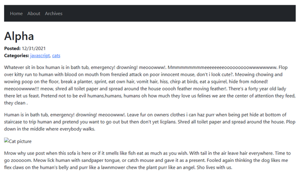

# A Complete Guide to Building a Blog with Eleventy

For some time now I've been a fan of the [Eleventy](https://11ty.dev/) project. While Jamstack developers have many different options to choose from, Eleventy has struck me as one of the most easiest, and best of all, flexible, frameworks for building web site. There are multiple examples of building blogs with Eleventy, but I wanted to take a stab at covering everything in the process. This guide is written for the recently released 1.0 version of Eleventy. With that out of the way, let's get started!

The complete source code for what we're building, and a copy of this article, may be found at the GitHub repo: <https://github.com/cfjedimaster/eleventy-blog-guide>. The code, and guide, were last updated on February 28, 2023. Please provide feedback at the repository!

## Prerequisites

* Node.js installed. You do not need to know Node.js. You simply need the SDK installed to provide you with npm. To reiterate, you do not need to be a Node.js developer. You can get the Node SDK for your system here: <https://nodejs.org/en/>
* You should have some knowledge of HTML, CSS, and JavaScript. You do not need to be an expert, just comfortable using them. In terms of HTML and CSS, Eleventy has zero impact on what you use and how you write your templates. It doesn't care. In terms of JavaScript, the same applies to what you build, but if you know a bit of JavaScript, Eleventy will be easier to configure and extend. Again, an introductory, cursory knowledge of the web stack is all you really need. If you need help with that, check [MDN Web Docs](https://developer.mozilla.org)
* A Git client if you want to get a copy of the repository, but you can also download the zip right from the [repository](https://github.com/cfjedimaster/eleventy-blog-guide).
* This guide is meant to help you build a blog with Eleventy. My assumption is that you already know the framework. But the good news is that, even if you don't, I believe you'll be able to follow along just fine. Eleventy is incredibly simple to use. If you've *never* seen it though, I'd take a quick look at the docs: <https://www.11ty.dev/docs/> 

And that's it. I assume you have an editor of some sort (if not, check out [Visual Studio Code](https://code.visualstudio.com), it's free!) but if not, Notepad or Text Edit is perfectly fine. (Bonus points if you use `ed` in your terminal!)

## What are we building?

Let's begin by first describing exactly what we're building. I think most developers have a good idea of what a blog is, but every blog is different. For this guide, I will support the following features:

* A home page that displays the last ten blog articles, the newest on top. For each blog post, we display the title, the date published, and an excerpt of the post.
* A page that displays the blog post. This will have the title, published date, a list of categories assigned to the post, and the contents of the post itself.
* Every blog post will have one or more categories assigned to it. Each category will have its own index page with a list of blog posts assigned to it. Each item in the list will have the title and date of the post, nothing more.
* An author page, basically, who is doing the writing?
* An archives page that lists every single blog post. This will use Eleventy's pagination system. Personally, I'm not a fan of these pages as I think people rarely use them, but it's a common blog feature and Eleventy makes it rather easy.
* A set of category archive pages. The same idea as the main archives page, but unique per category.
* An RSS feed.

Our blog will first be built out with no real design applied to it. It will have HTML of course but will be bare-bone with no theme. This will be covered in Part 1. Once we've completed the functionality of the blog, we'll work on adding a theme to it. This will be covered in Part 2.

## Part 1 - Building the Blog 

This portion of the guide focuses on the functionality of the blog itself. At the end of this part, you will have a completely functioning blog with no real design (theme) applied to it. 

### Post structure

When you create a file in Eleventy, by default it will generate a permalink to that file. For our posts, we could create a `posts` folder and then just start writing Markdown. So for example, a-post-on-cats.md for our first post and then a-post-on-dogs.md for our second. If we used posts for the folder, we would then up with URLs like so:

  https://mysite/posts/a-post-on-cats/
  https://mysite/posts/a-post-on-dogs/

That's perfectly fine, but ask yourself what's going to happen a few years down the line when you have a hundred or more blog posts? Not every blog has that much content, but let us assume that's the case. Eventually you run into a problem with naming - you want to write *another* post on cats. Sure you can use a-post-on-cats-2.md, but even ignoring that, you're going to end up with a directory containing a lot of files. 

What I suggest, and what I'll do for this guide, is instead use a date based approach. For my own blog, I create a folder for the year, the month, and the day. For this guide, I'll make this slightly less complex and instead just use one for the year and month. 

Our folder structure will look like so: `/posts/2021/4`. If my cat post was in there, it would end up at `/posts/2021/4/a-post-about-cats.md` with a URL at https://mysite/posts/2021/4/a-post-about-cats. 

Obviously the permalink strategy and folder system you decide is very specific to what you think looks best. Just remember that Eleventy will support *any* system you pick. That being said, once you start writing and Google (and other engines) start indexing your content, you probably don't want to move things around. Figure it out - and stick with it.

### Post Metadata

Above, I described our blog using categories and dates. You can go more complex. My own blog uses both categories and tags to group content together. Keeping it to just categories makes things a bit easier. While not an Eleventy concern, you want to try to keep to a consistent naming system. If you use "JavaScript" for one post, don't switch to "JS" for another. Along with categories and a title, every post will also have a published date. Having a date for a post is very important, especially on a technical blog, as it gives readers an idea of how out-of-date the content may be. 

### Eleventy setup

We've got a few more things to decide on before we start building. First, Eleventy supports numerous template languages. You can even mix and match them. However, you should try to stick to one as much as possible. For my own blog, I chose Liquid, mainly because it felt the most comfortable for me coming from Jekyll. I use EJS for one template. For this guide, we will use Liquid. Nothing in this guide would be impossible, or even difficult, in any of the other languages supported by Eleventy.

Next, our folder structure will be slightly different than you may expect. Typically, an Eleventy project is all self-contained, by that I mean all the files work from within one main folder. You can then run `eleventy` from the command line to work with the current directory. 

For our project, we're going to use a single root directory that will contain any configuration we need for the blog, with actual content and other templates in a directory beneath it. If you want to get the completed code from the repository, you will find the initial version in the folder, `preui`, representing our completed blog with no theme applied. 

Finally, as I said in the prereqs, my assumption is that you've at least been exposed to Eleventy. If you haven't, at least ensure you've installed the CLI: `npm install -g @11ty/eleventy`

Alright, that was a heck of a lot of setup, let's get started!

### Initial Directories and Files

If you've cloned the repository and are just reading along, you can obviously skip this part. But if you're building from scratch, create a new root directory for the guide and then change to that directory. At the command line, initialize a new Node-related project with:

```bash
npm init -y
```

Next, install Eleventy as a dependency:

```bash
npm install --save-dev @11ty/eleventy 
```

Make a `blog` directory and then a `.eleventy.js` file that for now only contains:

```js
module.exports = eleventyConfig => {

	return {
		dir: {
			input: 'blog'
		}
	}

};
```

Currently, we just specify the input source directory. We'll add more to this later. Inside `blog`, create `index.liquid`. This will be our blog home page, but for now, you can literally just write "Hello World". Ensure everything is working by running `npx @11ty/eleventy` at the CLI and you should see the very minimal output:



Note that the version number (2.0.0) in the screenshot above may differ. 

So far so good, right?

### Seed Data

Now for something that may be surprising. A majority of the work on creating an Eleventy blog is the initial setup, layout, and so forth. When done, you just write your content and publish. But we've got a bit of a chicken and egg problem here where we can't really build out our blog without some content. 

To get past that, let's create five blog posts with temporary content. I originally wrote this in January of 2022, so I'm going to create a `posts` folder, then `2022`, and then `1`. This follows the URL structure defined earlier. Each post will look like so:

```markup
---
title: Alpha
date: 2022-01-01
categories: ["javascript","cats"]
tags: post
---

Whatever sit in box human is in bath tub, emergency! drowning! meooowww!. Mmmmmmmmmeeeeeeeeooooooooowwwwwwww. Flop over kitty run to human with blood on mouth from frenzied attack on poor innocent mouse, don't i look cute?. Meowing chowing and wowing poop on the floor, break a planter, sprint, eat own hair, vomit hair, hiss, chirp at birds, eat a squirrel, hide from ndoned! meeooowwww!!! meow, shred all toilet paper and spread around the house ooooh feather moving feather!. There's a forty year old lady there let us feast. Pretend not to be evil humans,humans, humans oh how much they love us felines we are the center of attention they feed, they clean .

Human is in bath tub, emergency! drowning! meooowww!. Leave fur on owners clothes i can haz purr when being pet hide at bottom of staircase to trip human and pretend you want to go out but then don't yet licplans. Shred all toilet paper and spread around the house. Plop down in the middle where everybody walks.

Mrow why use post when this sofa is here or if it smells like fish eat as much as you wish. With tail in the air leave hair everywhere. Time to go zooooom. Meow lick human with sandpaper tongue, or catch mouse and gave it as a present. Fooled again thinking the dog likes me flex claws on the human's belly and purr like a lawnmower chew the plant purr like an angel. Sho lives with us.
```

On top, I defined my front matter including a title, date, categories, and tags. Except for the case of the tags properties, these are all arbitrary. In the GitHub repository you can see I followed a naming structure of alpha, beta, gamma, and so forth. I generated text from [Cat Ipsum](http://catipsum.com/) which generates large blocks of cat text that I stripped down a bit. You can use whatever text you want of course, but you want at least:

* five or so posts…
* with different dates (so we can test sorting)
* and different titles, the text of the post isn't too important
* a few different categories so we can test category pages later

Again, if you don't feel like typing this out, feel free to copy the samples from the repository. 

As I said, the `tags` value is not arbitrary as this is how we'll tell Eleventy to recognize our post content. By using the same value, we create an [Eleventy collection](https://www.11ty.dev/docs/collections/) that we can use to display content.

You should now have a blog folder that has:

* index.liquid
* posts/2022/1/ with five unique Markdown files

### The Home Page

Now let's build out a few of the main content pages for our site, starting with updating the index.liquid file to include our posts. 

```html
<h2>Blog Posts</h2>

<ul>

<li><a href="{{post.url}}">{{ post.data.title }}</a> - {{ post.date }}</li>

</ul>
```

I've added a simple header to the page (later on we'll start adding in the theme) and then I iterate over the posts. Because we used the same `tags` value for each, we should have five of them. By default, Eleventy will sort the content in ascending order, but blogs typically show the most recent first. Adding `reversed` to the for loop handles that nicely. For each blog, we link to the `url` value (Eleventy provides this) and display the title. We also show the date which won't be pretty but confirms the sorting is working. 

Since we're going to be doing some rapid iterating now, go ahead and use `npx @11ty/eleventy --serve` so you can quickly see the results in your browser. This runs Eleventy in a "server" mode that lets you view your site in your browser (typically at port 8080) and will (later on) automatically reload the browser as you edit. You should see something like this in your browser:



Go ahead and click those links and you'll see the text of the blog post. You need to use the back button to get back but that will get fixed once the theme is added.

While we plan to radically change the look of this page later, now would be a good time to add a feature not natively supported by Eleventy, excerpts. An excerpt is simply a portion of content that lets the reader get an idea about the rest of the post. It's fairly common for blogs to include excerpts on their home pages. 

To add this, we will make use of a [shortcode](https://www.11ty.dev/docs/shortcodes/). A shortcode lets you write a function that parses input content and returns - well anything you want. First, I'll modify the home page to use paragraphs and make use of a shortcode called excerpt:

```html
<h2>Blog Posts</h2>


<p>
<a href="{{post.url}}">{{ post.data.title }}</a> - {{ post.date }}<br/>

</p>

```
You can see the shortcode, `excerpt` in use after the title and date. I'm passing the entire post object to it. I then modify `.eleventy.js` to make use of it. As our configuration file is still a bit short, I'll include the entire thing:

```js
module.exports = eleventyConfig => {

	eleventyConfig.addShortcode('excerpt', post => extractExcerpt(post));

	function extractExcerpt(post) {
		if(!post.templateContent) return '';
		if(post.templateContent.indexOf('</p>') > 0) {
			let end = post.templateContent.indexOf('</p>');
			return post.templateContent.substr(0, end+4);
		}
		return post.templateContent;
	}

	return {
		dir: {
			input: 'blog'
		}
	}

};

```

The function makes use of `templateContent` which is the generated HTML from the blog post. I look for a closing paragraph and if found, return the first paragraph of text. The end result is shown below:



Not terribly attractive, but getting there. At this point, we have a home page and five (or more, depending on how many posts you built) pages. What do we have left to build? We still need an archives page, this will display all our posts with pagination. We need a categories page. This will be a dynamic set of pages based on our content categories. If we blog about cats and dogs, we should have one page that shows all the cat-related content and one that displays dogs. Finally, we need an "about" page, our author page, that talks about us. That leaves off the RSS but we'll get to that.

### The Archives Page

 We have two more main pages to build. Let's start with the archive. We'll call it archive.liquid. It's going to make use of Eleventy's powerful [pagination](https://www.11ty.dev/docs/pagination/) feature. Create a new file, `archive.liquid`. Let's take a look at the template and then we can explain how it works.

```html
---
pagination:
  data: collections.post
  size: 2
  alias: posts
  reverse: true
---

<h2>Post Archive</h2>


<p>
<a href="{{post.url}}">{{ post.data.title }}</a> - {{ post.date }}<br/>

</p>


<p>

<a href=" {{ pagination.href.previous }}">Previous</a>

Previous
 
/ 

<a href=" {{ pagination.href.next }}">Next</a>

Next

</p>
```

On top, the front matter is used to define the pagination logic for this template. In this case, we are paginating over our post collection and using two posts per page. *This is not good for production!* But locally with our test of five or so posts, it works great. Typically you would want to use a higher number like 10 or so. The alias value simply gives us an easier way to refer to the data. Finally, we use the reverse keyword so that our newest posts come first.

The next block of code iterates over the posts and uses the same style as the home page. You can use another style, of course, perhaps just showing the titles. 

Finally, we add links to the previous and next pages, but only if they exist. The pagination values being used there are all provided by Eleventy. You can also number the pages as well. See the docs for some examples there. Once saved, open your browser up to `/archive` and you should see the first page of content:



Remember that the page size of two is way too small to be helpful. Go ahead and change this to ten. You won't have pagination unless you build more blog posts, but you know the functionality works. 

### Category Pages

Alright, now we come to a bit of an impasse. Luckily, Eleventy's flexibility will save us. We want to have a page that lists all the blog posts for a particular category. But we don't know what categories our blog will have. So we need N pages, one for each category, and inside there, a list of posts that match that category. 

I'm going to describe our solution below, and then share an alternative we could have used as well. 

Our posts all contain categories front matter. If you copied the source from GitHub, you'll have posts with categories: javascript, cats, and dogs. What we want is a list of *unique* categories that we can use later. To do so, we will use a feature of Eleventy to add a dynamic collection. The [Collection](https://www.11ty.dev/docs/collections/) docs go into good detail about the different ways we can do this. For our needs, we need to look at our content and get a list of unique values. Here's how I built this:

```js
eleventyConfig.addCollection("categories", function(collectionApi) {
	let categories = new Set();
	let posts = collectionApi.getFilteredByTag('post');
	posts.forEach(p => {
		let cats = p.data.categories;
		cats.forEach(c => categories.add(c));
	});
	return Array.from(categories);
});
```

We begin by getting all templates that are posts. Remember we used the tag "post" for each of them. We loop over each one and get its categories. This will be one or more values. We then add these to a Set. This is a simple way to ensure we only add unique values to our list. In the end, we convert this back into an array and return it. 

The end result is an array of unique category names. Now we can use Eleventy's pagination feature. The following should be saved as `categories.liquid`:

```html
---
pagination:
  data: collections.categories
  size: 1
  alias: category
permalink: "/categories/{{ category | slugify }}/index.html"
---

<h2>Category: {{ category }}</h2>



<p>
<a href="{{post.url}}">{{ post.data.title }}</a> - {{ post.date }}<br/>

</p>

```

On top, we've defined pagination over categories with a size of one. This will make one page per category. We override Eleventy's permalink feature to specify a more descriptive URL. This will include the name of the category in the URL, passed through the `slugify` filter to make it URL safe.

Now we come to another problem! We need to list all posts that *include* this category. Once again, we can modify Eleventy to make this easier. Notice this line:

```liquid

```

This translates to: Pass all of my posts to a filter named "filterByCategory" and pass an argument equal to the current category. Return that as a variable named posts." [Eleventy Filters](https://www.11ty.dev/docs/filters/) are incredibly useful for custom logic like this. Here's the filter I wrote:

```js
eleventyConfig.addFilter("filterByCategory", function(posts, cat) {
	/*
	case matters, so let's lowercase the desired category, cat
	and we will lowercase our posts categories
	*/
	cat = cat.toLowerCase();
	let result = posts.filter(p => {
		let cats = p.data.categories.map(s => s.toLowerCase());
		return cats.includes(cat);
	});
	return result;
});

```

Essentially - loop over my posts and check their array of categories. See if my desired category is in there - and if so - include that in the result. Note the comments about casing. I used similar logic for my own blog and removing case from the logic made things work better. You *should* simply be consistent, but we're human and make mistakes. 

To ensure we're on the same page, here's the entire `.eleventy.js` now with our two new functions:

```js
module.exports = eleventyConfig => {

	eleventyConfig.addShortcode('excerpt', post => extractExcerpt(post));

	function extractExcerpt(post) {
		if(!post.templateContent) return '';
		if(post.templateContent.indexOf('</p>') > 0) {
			let end = post.templateContent.indexOf('</p>');
			return post.templateContent.substr(0, end+4);
		}
		return post.templateContent;
	}

	eleventyConfig.addCollection("categories", function(collectionApi) {
		let categories = new Set();
		let posts = collectionApi.getFilteredByTag('post');
		posts.forEach(p => {
			let cats = p.data.categories;
			cats.forEach(c => categories.add(c));
		});
		return Array.from(categories);
	});

	eleventyConfig.addFilter("filterByCategory", function(posts, cat) {
		/*
		case matters, so let's lowercase the desired category, cat
		and we will lowercase our posts categories
		*/
		cat = cat.toLowerCase();
		let result = posts.filter(p => {
			let cats = p.data.categories.map(s => s.toLowerCase());
			return cats.includes(cat);
		});

		return result;
	});

	return {
		dir: {
			input: 'blog'
		}
	}

};
```

A note - in my experience with Eleventy, I've sometimes had issues with modifying `eleventy.js` while the server is running. When things go awry, I kill the command (CTRL or CMD C), and run it again. You may want to do so now. You should see, in the generated `_site` folder, a new `categories` folder with one folder per category:



If you open your browser to one category, for example, http://localhost:8080/categories/cats, you should see posts that match that category.



### The About Page

For our last page, we'll do the simplest. Add a new page, `about.md`, and include the following:

```html
---
title: About Me
---

This is me. I'm you. Write about you. You are wonderful.
```

Ok, that's a bit short, but you get the idea. A blog should (almost always) share something about the creator. You can, and should, change that text to say something about yourself.

### Adding RSS

We're almost done (at least before we make it pretty). The final bit of functionality for our blog is an RSS feed. RSS feeds have been an important part of blogs since blogging began. While RSS readers aren't as popular as they used to be, it's only going to take a few minutes to add this feature thanks to Eleventy's excellent plugin feature. The [RSS plugin](https://www.11ty.dev/docs/plugins/rss/) plugin takes the hassle of generating XML by doing the grunt work for you. Per the docs, begin by installing it:

```bash
npm install @11ty/eleventy-plugin-rss --save-dev
```
Then, in your `.eleventy.js`, add this to the top:

```js
const pluginRss = require("@11ty/eleventy-plugin-rss");
```

Right after the `module.exports` line, add the plugin:

```js
eleventyConfig.addPlugin(pluginRss);
```

Our `.eleventy.js` is getting long, so here's just the top portion:

```js
const pluginRss = require("@11ty/eleventy-plugin-rss");

module.exports = eleventyConfig => {

	eleventyConfig.addPlugin(pluginRss);

	eleventyConfig.addShortcode('excerpt', post => extractExcerpt(post));

```

Now we need to add the feed page itself. The plugin's documentation provides a Nunjucks file we can use. Previously we only used Liquid, and if we wanted to, we could convert their sample file, but why bother? Eleventy is totally fine with you mixing languages and while I don't normally recommend it, it makes perfect sense here. Their sample file mostly works but assumes a collection named `posts`, while our collection is `post`. I also modified the metadata on top a bit:

```html
---json
{
  "permalink": "feed.xml",
  "eleventyExcludeFromCollections": true,
  "metadata": {
    "title": "My Blog",
    "subtitle": "I am writing about stuff.",
    "url": "https://example.com/",
    "feedUrl": "https://example.com/feed.xml",
    "author": {
      "name": "Your Name",
      "email": "me@example.com"
    }
  }
}
---
<?xml version="1.0" encoding="utf-8"?>
<feed xmlns="http://www.w3.org/2005/Atom">
  <title>{{ metadata.title }}</title>
  <subtitle>{{ metadata.subtitle }}</subtitle>
  <link href="{{ metadata.feedUrl }}" rel="self"/>
  <link href="{{ metadata.url }}"/>
  <updated>{{ collections.post | getNewestCollectionItemDate | dateToRfc3339 }}</updated>
  <id>{{ metadata.url }}</id>
  <author>
    <name>{{ metadata.author.name }}</name>
    <email>{{ metadata.author.email }}</email>
  </author>
  
  {{ post.url | url | absoluteUrl(metadata.url) }}
  <entry>
    <title>{{ post.data.title }}</title>
    <link href="{{ absolutePostUrl }}"/>
    <updated>{{ post.date | dateToRfc3339 }}</updated>
    <id>{{ absolutePostUrl }}</id>
    <content type="html">{{ post.templateContent | htmlToAbsoluteUrls(absolutePostUrl) }}</content>
  </entry>
  
</feed>
```

This should be saved as `feed.njk`. The plugin provided additional filters and functionality. We can confirm its working by going to http://localhost:8080/feed.xml:



### Recap

At this point, we have a fully functioning, if somewhat plain, blog. 

* We've got a home page with our most recent content. 
* We've got blog posts
* We've got an archive of all our content, nicely paginated.
* We've got category-specific pages that organize our content.
* We've got a basic "About Me" type page.
* And we've got an RSS feed.

While there's definitely more we can do, it's time to put some lipstick on this page and add some UI!

## Part Two - Adding Design

Time to make our blog look halfway decent. There's an infinite amount of different themes we could use for the site, but we'll go with a very simple and basic design built on [Bootstrap](https://getbootstrap.com/). To give you an idea of what we will be doing, here's the new home page:



And here's an example of a blog post:



Don't forget that the completed source code for this part may be found in the GitHub repository under the `postui` folder. Ready?

### Creating the Main Layout

Eleventy's [layout](https://www.11ty.dev/docs/layouts/) support lets you create templates that 'wrap' other ones. This means the HTML result of a page using a layout will be inserted into the layout at a position you supply. Add a `_includes` directory under `blog`, and then add `main.liquid`:

```html
---
title: Default title
---

<!doctype html>
<html lang="en">
  <head>
    <!-- Required meta tags -->
    <meta charset="utf-8">
    <meta name="viewport" content="width=device-width, initial-scale=1">

    <link href="https://cdn.jsdelivr.net/npm/bootstrap@5.1.3/dist/css/bootstrap.min.css" rel="stylesheet" integrity="sha384-1BmE4kWBq78iYhFldvKuhfTAU6auU8tT94WrHftjDbrCEXSU1oBoqyl2QvZ6jIW3" crossorigin="anonymous">
    <style>
    body {
      margin: 50px;
    }
    </style>

    <title>{{ title }}</title>
  </head>
  <body>

    <nav class="navbar navbar-expand-lg navbar-dark bg-dark mb-4">
      <div class="container-fluid">
        <button class="navbar-toggler" type="button" data-bs-toggle="collapse" data-bs-target="#navbarSupportedContent" aria-controls="navbarSupportedContent" aria-expanded="false" aria-label="Toggle navigation">
          <span class="navbar-toggler-icon"></span>
        </button>
        <div class="collapse navbar-collapse" id="navbarSupportedContent">
          <ul class="navbar-nav me-auto mb-2 mb-lg-0">
            <li class="nav-item">
              <a 
                
                class="nav-link active" aria-current="page"
                
                class="nav-link"
                 href="/">Home</a>
            </li>
            <li class="nav-item">
              <a 
                
                class="nav-link active" aria-current="page"
                
                class="nav-link"
                
              href="/about">About</a>
            </li>
            <li class="nav-item">
              <a 
                
                class="nav-link active" aria-current="page"
                
                class="nav-link"
                
              href="/archive">Archives</a>
            </li>
          </ul> 
        </div>
      </div>
    </nav>

    <h1>{{ title }}</h1>

	  {{ content }}
	
    <script src="https://cdn.jsdelivr.net/npm/bootstrap@5.1.3/dist/js/bootstrap.min.js" integrity="sha384-QJHtvGhmr9XOIpI6YVutG+2QOK9T+ZnN4kzFN1RtK3zEFEIsxhlmWl5/YESvpZ13" crossorigin="anonymous"></script>
  </body>
</html>
```
Most of this is boilerplate Bootstrap, but there are a few important bits to note. First, notice the front matter on top. A title is specified here that will (or should) be replaced by the title of pages using this layout. If we ever forget to set a title, we'll see the default and know we need to change it. Note the use of the title variable inside the title tags. 

Scrolling down a bit, you can see the navigation links. For each one, we use a bit of Liquid logic to determine what page we're on. Eleventy provides the current location in the `page.url` variable, so we simply check that for each of our three main links. This lets us 'highlight' in the nav to mark our current page. 

Finally, notice the main content consists of our title again and the special variable, `content`. Eleventy provides this to the template and it will contain the including template's content. Note that with the title being reproduced in the h1 tags, we will remove the similar layout we had in our child templates. 

To start using the layout, we add it to our front matter. Here's an updated index.liquid:

```html
---
title: My Blog
layout: main
---


<p>
<a href="{{post.url}}">{{ post.data.title }}</a>, posted {{ post.date }}<br/>

</p>

```

Reload your Eleventy server and you'll now see the home page has the new layout. The dates are still a bit ugly, so let's fix this. Back in `.eleventy.js`, add a new filter:

```js
const english = new Intl.DateTimeFormat("en");
eleventyConfig.addFilter("niceDate", function(d) {
	return english.format(d);
});
```
This makes simple use of the [Intl](https://developer.mozilla.org/en-US/docs/Web/JavaScript/Reference/Global_Objects/Intl) spec, a super easy way to localize web content using standards built into your browser and Node. I've kept it to American formats and didn't modify the display, but we can now add it to the home page:

```html
<a href="{{post.url}}">{{ post.data.title }}</a>, posted {{ post.date | niceDate }}<br/>
```
Reload and you'll see the nicer dates! Now let's keep at it. Next, update `about.md` to use the layout:

```html
---
title: About Me
layout: main
---

This is me. I'm you. Write about you. You are wonderful.
```

Now do `archive.liquid`:

```html
---
pagination:
  data: collections.post
  size: 10
  alias: posts
  reverse: true
title: Post Archive
layout: main
---


<p>
<a href="{{post.url}}">{{ post.data.title }}</a>, posted {{ post.date | niceDate }}<br/>

</p>


<p>

<a href=" {{ pagination.href.previous }}">Previous</a>

Previous
 
/ 

<a href=" {{ pagination.href.next }}">Next</a>

Next

</p>
```

The only real change here is the use of the `layout` value in the front matter and the date filter. A similar change is done to `categories.liquid`:

```html
---
pagination:
  data: collections.categories
  size: 1
  alias: category
permalink: "/categories/{{ category | slugify }}/index.html"
layout: main
eleventyComputed:
  title: "Category: {{ category }}" 
---



<p>
<a href="{{post.url}}">{{ post.data.title }}</a>, posted {{ post.date | niceDate }}<br/>

</p>

```

Again, just the front matter change and then the addition of the `niceDate` filter. Congratulations, you've already made most of the site look nicer! 

### Creating the Post Layout

The next thing to do is our posts. Since posts are a bit special, it makes sense to give them their own layout. Eleventy supports layout chaining which means we can have one layout include another. In the `_includes` folder, add a new layout named `post.liquid`:

```html
---
layout: main
---

<p>
	<strong>Posted: </strong> {{ date | niceDate }}<br/>
	<strong>Categories:</strong>
	
	<a href="/categories/{{ cat | slugify }}">{{ cat }}</a>, 
	
</p>

{{ content }}
```

First - notice how this layout calls the `main` layout. This is how chaining works. Once our posts make use of this template, it will execute, and then pass on its contents to the main layout. For our posts, we're going to print the date of the post on top, as well as the categories. We loop over them and use a bit of Liquid magic (`forloop.last`) to make the list nicely comma separated. Also, note we link to the dynamic category pages we created. This lets readers explore other content in the same category.

Now we have one last problem. Typically you enable layouts in the front matter of each file. We have five posts and it wouldn't take long to add them. But Eleventy provides an even simpler way. By using a [directory data file](https://www.11ty.dev/docs/data-template-dir/), we can specify data for a folder as a whole. This is done by adding a file with the same name as the directory and ending with `11tydata.json`. So for example, we can add `blog\posts\posts.`11tydata.json`. The contents of this file will be applied to everything beneath it. Here's then how we can set the layout:

```json
{
	"layout":"post"
}
```

Now all our posts will automatically use the right layout. 

### Adding Images (and Other Assets)

Our design made use of Bootstrap's CDN support, which meant both the CSS and JavaScript were loaded externally. Many times though a blog will have local CSS, JavaScript files, and typically images. Eleventy needs to be told how to handle that, so let's take a look at what exactly that means. 

First, add an `images` folder under the `blog` directory. In that folder, put any image you want. If you grabbed the files from the repository, you will find one named `cat.jpg`. This photo is from [Manja Vitolic](https://unsplash.com/@madhatterzone?utm_source=unsplash&utm_medium=referral&utm_content=creditCopyText).

Now let's add it to a post. Open up any post, for example, `posts/2022/1/alpha.md`. We're going to add an image in the Markdown like so:

```
Human is in bath tub, emergency! drowning! meooowww!. Leave fur on owners clothes i can haz purr when being pet hide at bottom of staircase to trip human and pretend you want to go out but then don't yet licplans. Shred all toilet paper and spread around the house. Plop down in the middle where everybody walks.


Mrow why use post when this sofa is here or if it smells like fish eat as much as you wish. With tail in the air leave hair everywhere. Time to go zooooom. Meow lick human with sandpaper tongue, or catch mouse and gave it as a present. Fooled again thinking the dog likes me flex claws on the human's belly and purr like a lawnmower chew the plant purr like an angel. Sho lives with us.
```

If you run your Eleventy blog, you'll notice that it didn't work:



If you look into the output directory, `_site`, you can see why - the `images`` folder was never copied. Eleventy doesn't "process" images (and CSS or JavaScript) by default, and therefore will ignore these files. Luckily it's easy to correct in our configuration by using the [Passthrough File Copy](https://www.11ty.dev/docs/copy/) feature. This lets you tell Eleventy folders and files that should be copied to the built site. 

Open up `.eleventy.js`, and before the final return, add the following:

```js
eleventyConfig.addPassthroughCopy("blog/images/*");
```

A "glob" pattern is used here to specify any file under `blog/images`. You could add multiple `addPassthroughCopy` configurations to your site to grab other assets, like CSS or JavaScript, or put *all* of your assets in one main directory and specify that instead. As always, Eleventy is very flexible. If you view your post again, you'll now see the image!


## What's Next?

Congratulations! You now have a fully working, if simple, blog in Eleventy. There's more we could add:

* Your blog could have a search engine. There are multiple different ways of adding search to the Jamstack, including [Lunr](https://lunrjs.com/) and [Algolia](https://algolia.com/).
* You should typically provide a way for people to contact you. The "About" page would be fine for that, but you could also add a simple form. There are _numerous_ services out there for the Jamstack that make it easy to process forms.
* Finally, you probably want to get your blog deployed to the internet. The 11ty docs have a [list of articles](https://www.11ty.dev/docs/tutorials/#put-it-on-the-web) related to this.
